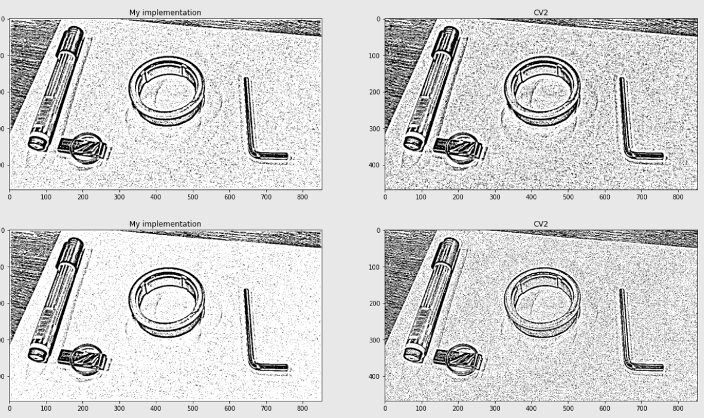
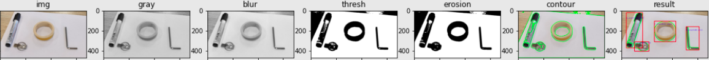
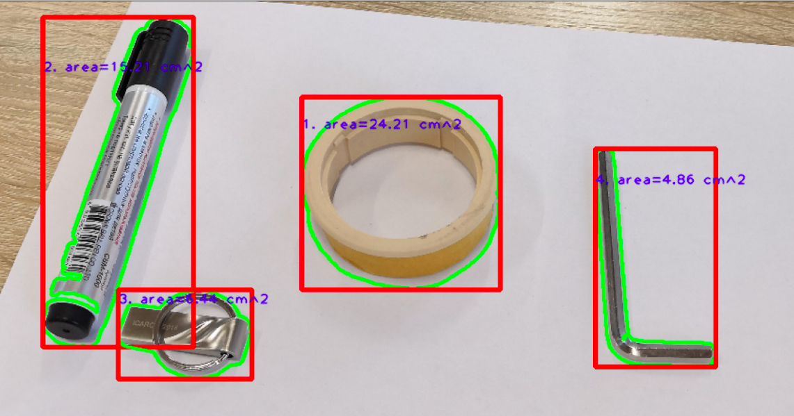
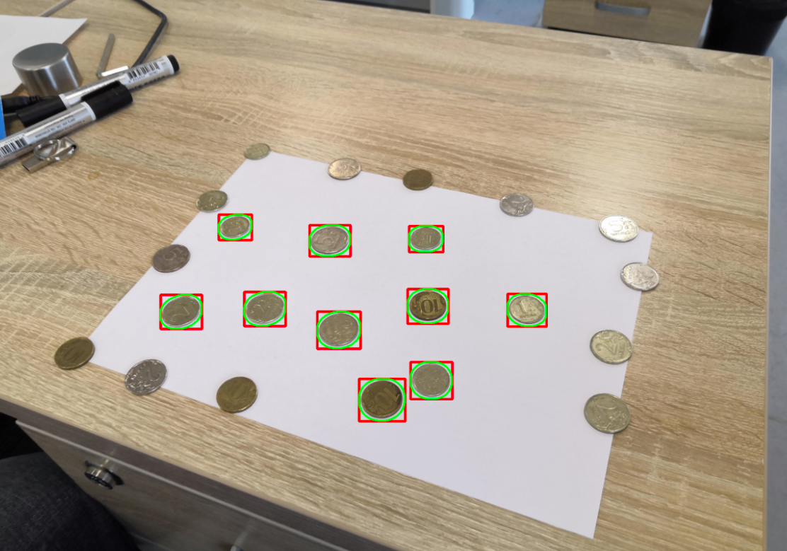
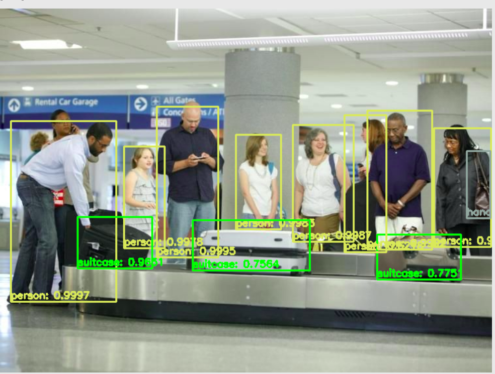
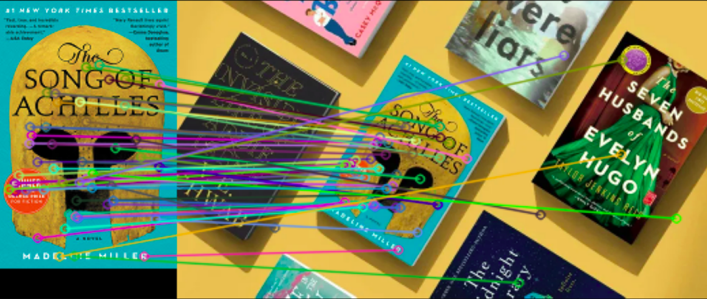
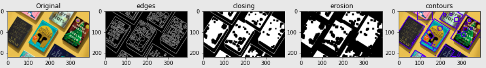
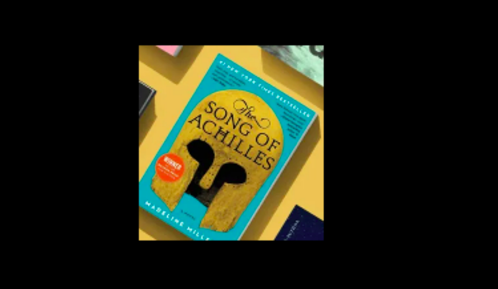
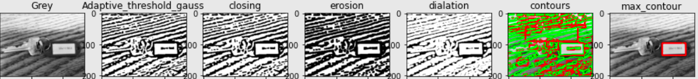
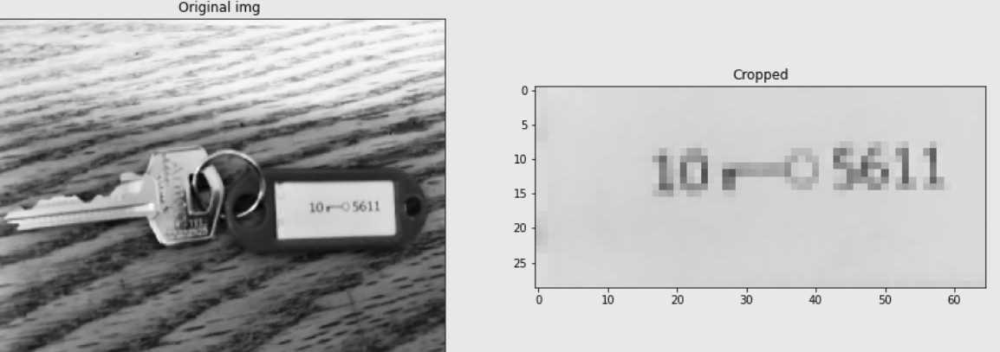

# ICV_Fall21IU
This repository is used to work on my assignments and homeworks in Introduction to Computer Vision course at Innopolis University Fall 2021

## Assignment 1

Assignment link: [here](https://github.com/hany606/ICV_Fall21IU/blob/main/Assignments/Assignment1_ICV_HanyHamed.ipynb)

#### Implementing "Adaptive Threshold"

#### Detecting and approximately measuring objects

#### Detecting and counting coins

## Assignment 2

Assignment link: [here](https://github.com/hany606/ICV_Fall21IU/blob/main/Assignments/Assignment2_ICV_HanyHamed.ipynb)

#### Implementing Intersection over Union (IoU) and non-maximum suppression to be used with YOLO object detection

## Midterm

Exam link: [here](https://github.com/hany606/ICV_Fall21IU/blob/main/Exams/Midterm.ipynb)

#### Using SIFT Keypoints to find a match of a book and extracting it

#### Extracting numbers from a keychain

